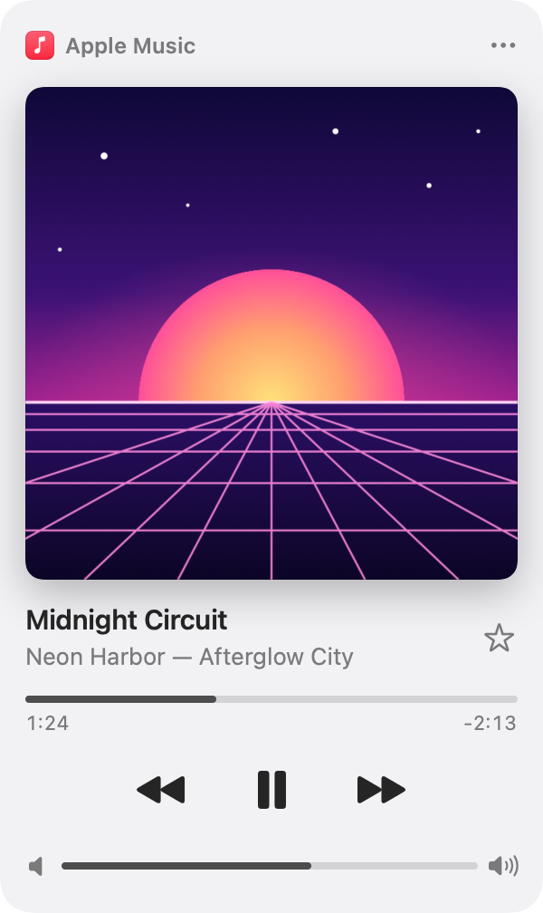
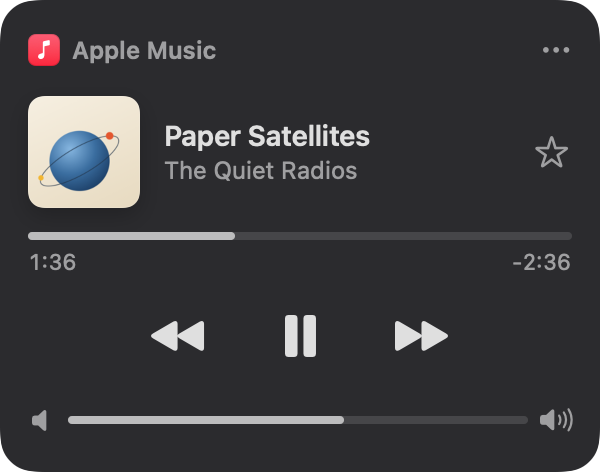
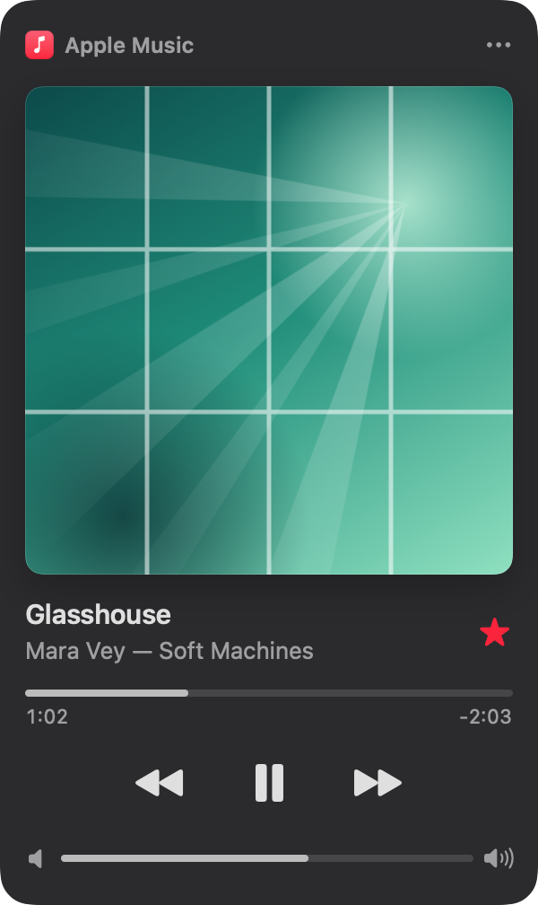

# NowBar

A macOS menu bar mini-player for Apple Music. Click the music note in the menu bar to see what's playing and control it without switching to the Music app.

<p align="center">
  
  
  
  <br>
  <sub>Left to right: Large Artwork (light), Compact (dark) and a favorited track (dark). Rendered by <code>make snapshots</code> from the built-in demo playlist: the songs and artwork are fictional.</sub>
</p>

NowBar is an independent project, not affiliated with or endorsed by Apple Inc. Apple Music is a trademark of Apple Inc.

## Features

- A music-note menu bar icon, optionally with "Title · Artist" beside it.
- A panel with the artwork, title / artist / album, a favorite star, a draggable progress bar, previous / play-pause / next, and a volume row with a mute button for the Mac's output volume. With the panel open, Space plays or pauses, and the left and right arrow keys go to the previous and next track.
- Two layouts, Large Artwork or Compact, chosen in the ⋯ menu. The ⋯ menu also holds Open Apple Music, Show Title in Menu Bar, Media Keys Control Apple Music, Launch at Login and Quit NowBar. While media keys are on but macOS hasn't granted access, it shows Allow Media Key Access… as well.
- Optional media key handling, off by default: macOS already sends your media keys to Apple Music when it was the last thing playing. With the option on, previous / play-pause / next always go to Apple Music while it is running, even when a browser video took over.
- Talks to Apple Music with Apple Events. NowBar never launches Music on its own.
- No Dock icon. Settings are stored in UserDefaults.
- A demo mode with a fake playlist, for trying it without Music.

## Requirements

- macOS 14 or later
- Apple Music (the Music app)
- To build: Xcode, or the Command Line Tools (`xcode-select --install`), with Swift 6

## Build, install and uninstall

```sh
make app       # release build, packaged and signed as build/NowBar.app
make install   # the same, then installs to /Applications/NowBar.app and launches it
```

Both use `scripts/build-app.sh`, which builds the `NowBar` product in release mode (for the architecture of the Mac you build on), assembles `build/NowBar.app` from the binary, `Resources/Info.plist` and `Resources/AppIcon.icns`, and signs it with the hardened runtime and the entitlement in `Resources/NowBar.entitlements`. It then checks the signature with `codesign --verify --strict` and confirms that the runtime flag and the entitlement made it in. It works from any directory and prints the final app path and the signing identity it used.

| Option or variable | Effect |
| --- | --- |
| `--install` | Also copy the app to `/Applications/NowBar.app`, replacing an existing NowBar there. If `/Applications` isn't writable for your account (a standard user, say), it goes to `~/Applications/NowBar.app` instead and the script says so. |
| `--open` | Launch the result: the installed copy with `--install`, otherwise `build/NowBar.app`. |
| `--demo` | Launch with `--demo`; implies `--open`. |
| `NOWBAR_BINARY=/path` | Bundle this prebuilt executable instead of running `swift build`. A relative path is relative to the directory you run the script from. |
| `SIGN_IDENTITY="..."` | Sign with this identity instead of ad-hoc. |
| `NOWBAR_INSTALL_DIR=/path` | Install somewhere other than `/Applications`. A relative path is relative to the directory you run the script from. The folder is used as given: if it isn't writable, the script stops with an error instead of falling back to `~/Applications`. |

Builds are ad-hoc signed by default. Set `SIGN_IDENTITY` to your own code-signing certificate (`security find-identity -v -p codesigning` lists yours) so macOS keeps NowBar's permissions across rebuilds; see First run and permissions.

The script only ever acts on NowBar itself. `--install` and `--open` first quit a running NowBar and wait for it to exit. Otherwise the old build would keep running, and `open` would only bring it to the front and ignore `--demo`. Only a process whose executable sits in an app bundle with NowBar's bundle identifier (`local.nowbar.NowBar`, read from `Resources/Info.plist`) is signalled; another process that merely has the same name is left alone, and the script says so. In the same way, `--install` replaces an existing `NowBar.app` only if it has that identifier, and stops with an error otherwise. It also refuses to install over the `build/NowBar.app` it has just built.

If an older copy exists in `~/Applications`, `--install` moves it to the Trash (it never deletes it) and says so. If the move fails, the script warns and leaves the old copy where it is, so drag it to the Trash yourself. Nothing is moved when `~/Applications` is where the new copy went, or when the app there isn't NowBar.

Installing to a new location can make macOS ask for the Accessibility and Automation permissions again, just as a rebuild does: see First run and permissions.

To uninstall, first turn off Launch at Login in the ⋯ menu and quit NowBar from the same menu, then:

```sh
rm -rf /Applications/NowBar.app                  # or drag it to the Trash
rm -rf ~/Applications/NowBar.app                 # only if it is installed there
defaults delete local.nowbar.NowBar              # saved settings (errors if there are none)
tccutil reset AppleEvents local.nowbar.NowBar    # forget the Automation permission
tccutil reset Accessibility local.nowbar.NowBar  # forget the Accessibility permission
```

## First run and permissions

NowBar needs one macOS permission, Automation, and asks for a second, Accessibility, only if you turn on the media keys option. It starts without either.

**Automation (Apple Music).** The first time NowBar talks to a running Music app, macOS asks whether "NowBar wants to control Music". Choose OK. NowBar never launches Music itself, so start Music first, or use ⋯ → Open Apple Music. If you deny the request, the panel explains how to fix it: open System Settings → Privacy & Security → Automation and switch Music on under NowBar.

**Accessibility (media keys, optional).** Only Media Keys Control Apple Music needs it, and that option is off by default, so NowBar never asks for Accessibility when it starts. Your media keys already reach Music through macOS whenever Music was the last thing playing. Turning the option on in the ⋯ menu makes them always go to Music, even when a browser video took over, and that is when NowBar asks. If the permission is missing, it asks every time you switch the option on: with the system prompt the first time, and after that by opening System Settings → Privacy & Security → Accessibility, where you switch NowBar on (use + to add it if it isn't listed). While the option is on but the permission is missing, the ⋯ menu also shows Allow Media Key Access…, which asks again. Without this permission the panel works as usual and the media keys keep going to macOS.

**Rebuilds and moves can make macOS forget the grants.** `scripts/build-app.sh` signs ad-hoc by default, and an ad-hoc signature identifies the app only by a hash of its code (`codesign -d -r- build/NowBar.app` prints `designated => cdhash H"..."`). Every rebuild is therefore a different app to macOS, which forgets the Automation and Accessibility grants and can leave stale entries in the lists. Moving the app to a new location can do the same, for example from `~/Applications` to `/Applications`. After rebuilding or moving the app, clear the grants and grant them again when prompted:

```sh
tccutil reset AppleEvents local.nowbar.NowBar
tccutil reset Accessibility local.nowbar.NowBar
```

To avoid this, sign with your own code-signing certificate (`SIGN_IDENTITY="Name of a code-signing certificate" make app`). The signature then identifies the app by that certificate instead of by a hash of its code, so macOS keeps NowBar's permissions across rebuilds.

## Media keys

Media Keys Control Apple Music is off by default. While it is off, NowBar leaves your media keys alone: macOS sends them to Music whenever Music was the last thing playing, and to whatever else took over (a browser video, say) otherwise.

Turn the option on in the ⋯ menu to make them always go to Music, even when a browser video took over. It needs Accessibility permission, which NowBar asks for only at that moment. With the permission and the option on:

- Previous, play/pause and next always go to Apple Music while it is running, even if a browser tab is playing.
- When Music isn't running, macOS handles those keys as usual.
- Mute and the volume keys keep controlling the Mac's volume, and the panel's volume row mirrors them.

Turn Media Keys Control Apple Music off again in the ⋯ menu to stop NowBar intercepting the keys.

## Settings

Everything is stored in UserDefaults under the bundle identifier `local.nowbar.NowBar` (`defaults read local.nowbar.NowBar`).

| Key | Values | Default |
| --- | --- | --- |
| `panelLayout` | `large` or `compact` | `large` |
| `showTitleInMenuBar` | Bool | `false` (icon only) |
| `mediaKeysEnabled` | Bool | `false` (off until you turn it on) |

## Security and privacy

NowBar is a small tool that sits between your keyboard, the Music app and the menu bar, so what it can see and do is worth spelling out.

- **No network, no analytics.** NowBar has no networking code, no analytics, no telemetry and no crash reporting. It shows what Music reports on your Mac and sends nothing anywhere.
- **Automation (Music).** NowBar reads what is playing (title, artist, album, position, favorite state and artwork) and sends play, pause, next, previous, seek and favorite. It never launches Music on its own, and each of its scripts checks that Music is running before it does anything.
- **Accessibility, only if you opt in, and for the media keys only.** NowBar requests it only when you turn on Media Keys Control Apple Music, which is off by default; without it NowBar never asks. The event tap that catches the media keys is limited to system-defined events, which is where the media keys arrive, and it ignores everything in them except those keys. Play/pause, next and previous are handled; the volume and mute keys pass through to macOS untouched. Regular keystrokes are a different kind of event and never reach the tap, and it logs nothing.
- **The Mac's volume** is read and set through CoreAudio, which needs no permission.
- **Hardened runtime.** The app is signed with the hardened runtime and a single entitlement, `com.apple.security.automation.apple-events` (`Resources/NowBar.entitlements`), which a hardened app needs to send Apple Events to Music. Without the hardened runtime, any process of the same user could launch NowBar with `DYLD_INSERT_LIBRARIES` and borrow its Accessibility and Automation permissions. NowBar is not App Sandboxed.
- **Music's data is treated as untrusted.** Artwork is size-limited and decoded by ImageIO off the main thread, and anything unreadable becomes the placeholder tile. Track IDs, titles, artists and positions reach AppleScript as typed arguments, never as text spliced into a script.
- **Logs contain no song titles.** NowBar writes a few short lines to the unified log (subsystem `local.nowbar.NowBar`), such as "play requested" or "favorite write: matched=true favoritedAfter=false", never a title, an artist or a track ID. Music's own error text, which can quote a track's name, is logged as private.
- **What it stores:** the three settings above, in UserDefaults. Artwork is kept in memory and never written to disk.

To report a security issue, open a GitHub issue.

## Architecture

NowBar is a Swift package of small modules. The contracts live in a Foundation-only core, the macOS integrations sit behind them, and the SwiftUI layer talks only to those contracts. That is what lets demo mode and the snapshot tool run the same UI against a fake player.

| Module | What it holds |
| --- | --- |
| `NowBarCore` | The contracts and models, Foundation only: `PlayerController`, `SystemVolumeControlling` and `MediaKeyIntercepting`, plus `PlayerSnapshot`, `Track`, `SystemVolume`, `MediaKey`, `PanelLayout` and the settings keys. |
| `NowBarServices` | The macOS integrations, each behind a Core contract. `AppleMusicController` drives Music with AppleScript on a private serial queue and keeps a small artwork cache. `SystemVolumeController` reads and sets the output volume with CoreAudio. `MediaKeyTap` is the event tap for the media keys. |
| `NowBarUI` | SwiftUI. `PlayerStore` is the observable state, with optimistic updates and the settings. `PlayerPanel` and its controls draw the panel. `WindowFitter` sizes the menu bar window. The demo player and the snapshot renderer live here too. |
| `NowBar` | The app: a `MenuBarExtra` in window style that wires the services into the store. `--demo` swaps in the demo player and a fake volume, and leaves the media keys alone. |
| `NowBarSnapshots` | A small tool (`Tools/NowBarSnapshots`) that renders the panel to PNGs from demo data. |
| Tests | Swift Testing suites, one test target per library, with test doubles for the player, the volume and the media key source. |

Key decisions:

- **AppleScript over Apple Events, not MediaRemote.** MediaRemote, the private framework that now-playing apps used to read the system's playing state, has been restricted for third-party apps since macOS 15.4. Music's scripting dictionary is a supported interface that also exposes the favorite flag, the artwork and the exact position. Scripts are compiled once and run one at a time on a private queue, never on the main thread, each with a 3 second timeout so an unresponsive Music can't stall the app.
- **Never launching Music.** AppleScript would happily start an app it is told to talk to, so every script, and the controller before it, checks that Music is running first. Only the explicit Open Apple Music action launches it.
- **Explicit play and pause commands, not a toggle.** A repeated or late toggle flips playback back, while `play` while playing and `pause` while paused change nothing. The store decides from what the panel shows, and requests that come right after the previous one (a double click, a bouncing key) are ignored. Favorites are explicit too: the store sends "favorite" or "unfavorite" together with the track that was on screen, and the script only writes if the current track is still that one, so a click that races a track change never favorites the next song. The track is recognised by its ID or, when Music re-identifies it after adding it to the library, by title and artist.
- **Short "holds" against stale reads.** Music acknowledges a command a moment before its state changes, and it saves a favorite as a cloud edit that takes seconds, so a read right after an action can contradict what the user just did. For about a second and a half after a play/pause request, and about ten seconds after a favorite click, a reading of the same track that disagrees is treated as stale. The same track means the same ID or, when Music has re-identified the song, the same title and artist. The hold ends as soon as Music confirms, when the track changes, or when its time runs out. Removing a favorite is held differently: Music reads "not favorited" straight away, but only runs its favorites sync 10 seconds later, and the first sync after a removal restores the favorite. So an unfavorite is held for 25 seconds, and Music agreeing doesn't end that hold. `AppleMusicController` also reads Music again 12 seconds after the removal, once that sync has run, and re-sends the removal once if the favorite is back. If the removal still holds then, it looks once more at 25 seconds, in case the sync ran late. It does that once per click, never for favoriting, and whether or not the panel is open; a newer favorite click, stopping, or Music quitting cancels it.
- **A single-flight refresh.** Music posts a notification on every play, pause and track change, any process can post it, and Music can take seconds to answer. Refreshes therefore run one at a time: requests that arrive while one runs are coalesced into exactly one more, so they never pile up on the script queue. While the panel is open the store also polls every 2 seconds to stay in sync.
- **Resizing the menu bar window to its content.** A `MenuBarExtra` window is sized to its content when it opens and never again, so switching between Large Artwork and Compact left it the wrong size. `WindowFitter` measures the panel and resizes the window to match, keeping its top and left edges where they are so it stays attached to the menu bar.
- **Decision logic is kept pure and unit tested.** The media key decoder and gate, the refresh gate, the window fitting rule and the decision to re-send an unfavorite are plain values and functions with no I/O, so they are tested without a window, an event tap or Music.

## Demo mode and snapshots

`make demo` builds the app and opens it with `--demo`: a fake playlist, so Music isn't needed. Demo mode doesn't touch Music, the media keys or the Mac's real volume. To do it by hand, quit NowBar first and run `open build/NowBar.app --args --demo`.

`make snapshots` (`swift run NowBarSnapshots build/snapshots`) renders the panel to PNGs in `build/snapshots`, for checking the layout without running the app. The screenshots at the top of this page are three of them, copied to `docs/images/`; copy them again after a change to the panel's look.

## Development

```sh
make help        # list the targets
make build       # debug build
make test        # run the tests
make snapshots   # render panel PNGs
make icon        # regenerate Resources/AppIcon.icns
make clean       # remove .build, build and .build-*
```

The tests use Swift Testing. With only the Command Line Tools installed, the compiler needs the Testing macro plugin on its plugin path, which `make test` adds:

```sh
swift test -Xswiftc -plugin-path -Xswiftc /Library/Developer/CommandLineTools/usr/lib/swift/host/plugins/testing
```

### Project layout

| Path | Contents |
| --- | --- |
| `Package.swift` | Package manifest: macOS 14, Swift 6 tools, Swift 5 language mode. |
| `Sources/NowBarCore` | Shared models and service contracts (Foundation only). |
| `Sources/NowBarServices` | macOS integrations: the Apple Music bridge, system output volume, media keys. |
| `Sources/NowBarUI` | SwiftUI panel, menu bar label, observable store and settings. |
| `Sources/NowBar` | The menu bar app executable: wires the services into the UI. |
| `Tools/NowBarSnapshots` | Executable that renders the panel to PNGs. |
| `Tests/` | Swift Testing suites, one per library target. |
| `Resources/` | `Info.plist` (bundle id, `LSUIElement` for no Dock icon, the Automation usage text), `NowBar.entitlements` (the Apple Events entitlement the hardened runtime needs) and the generated `AppIcon.icns`. |
| `scripts/build-app.sh` | Builds, bundles, signs and optionally installs and launches the app. |
| `scripts/make-icon.swift` | Draws the icon and writes `Resources/AppIcon.icns` (intermediates go to `.build-pkg/`). |
| `design/prototype.html` | The clickable HTML prototype the panel's look was approved from before any code was written; open it in a browser. It predates the favorite button, the volume row and the media key settings. |
| `docs/images/` | The screenshots used in this README. |
| `Makefile` | Shortcuts for all of the above. |
| `LICENSE` | The MIT license. |
| `build/` | Output: `NowBar.app` and `snapshots/`. Not tracked by git. |

## Troubleshooting

**The panel says NowBar can't control Music.** Automation was denied. Switch Music on under NowBar in System Settings → Privacy & Security → Automation. If NowBar isn't listed, or macOS never asks again, run `tccutil reset AppleEvents local.nowbar.NowBar` and relaunch NowBar.

**The media keys still go to the browser or to macOS.** Media Keys Control Apple Music is off by default, so first check that it is on in the ⋯ menu (until then macOS sends the keys to Music only when Music was the last thing playing). Then check that NowBar is switched on under System Settings → Privacy & Security → Accessibility (⋯ → Allow Media Key Access… takes you there), and that Music is running (with Music closed, macOS handles the keys). After a rebuild, run `tccutil reset Accessibility local.nowbar.NowBar`, relaunch NowBar and grant the permission again.

**Nothing is playing and Play does nothing.** NowBar never launches Music on its own. Start it, or use ⋯ → Open Apple Music.

**Clicking the star shows "To add songs and playlists to your Library, you must use Cloud Music Library".** That dialog is Apple Music's own, not NowBar's. Favoriting a song adds it to your library, which needs Sync Library to be on (Music → Settings → General), and Music's own star behaves the same way. Choose Merge Library to turn Sync Library on, or Not Now to skip it; the star then turns itself back off within about 10 seconds, because Music didn't favorite the song. Even with Sync Library on, Music takes a few seconds to save a favorite; the star stays on while it does. Sync Library covers your whole music library, not just NowBar, so turn it on only if you want that.

**Removing a favorite: NowBar's star turns off at once, but Music's own star can take about 20 seconds.** Apple Music applies a removal made by another app through its own favorites sync, which runs 10 seconds later, and its first sync after a removal can restore the favorite. So NowBar keeps its star off for 25 seconds, checks again about 12 seconds after your click, once that sync has run (and once more at 25 seconds, in case the sync ran late), and if Music has restored the favorite it re-sends the removal once (once per click, even while the panel is closed). Music's own star can therefore take about 20 seconds to turn off. That is Music's schedule, not a lost click, and the star in NowBar is empty meanwhile, so clicking it again would favorite the song again. Removing a favorite never removes the song from your library: favoriting a song adds it to your library, and Apple Music keeps it there when you unfavorite it. To remove it, use Delete from Library in Music.

**The artwork is a placeholder.** Apple Music doesn't expose artwork for some streamed tracks, so NowBar shows a placeholder. Known limitation.

**The volume row can't change the volume.** Some outputs, such as certain HDMI or USB devices, have no adjustable volume, so there is nothing for NowBar to change.

**There is no menu bar icon.** Check that NowBar is running (`pgrep -x NowBar`). If it is, the menu bar may be too crowded to show it; free up some space.

**`swift test` can't find the Testing macros.** Use `make test`, which passes the plugin path (see Development).

**`make install` says NowBar is still running.** It waits ten seconds after asking NowBar to quit. Quit it from the ⋯ menu and run it again.

**`make install` says an existing app isn't NowBar.** The script replaces only an app whose bundle identifier is `local.nowbar.NowBar`, so it stops instead of touching whatever else is at `/Applications/NowBar.app` (or in the folder you gave with `NOWBAR_INSTALL_DIR`). Move that app away yourself, or install somewhere else.

## How it was built

NowBar was built with [Claude Code](https://claude.com/claude-code). Claude Opus 5.5 orchestrated the work: the architecture, the module contracts, the review and the integration. Claude Sonnet agents implemented the modules and the later fixes in parallel.

The author, Stanislav Artemyev, defined the requirements, approved a clickable HTML prototype (`design/prototype.html`) before any code was written, tested every build on real hardware, directed the fixes (several were diagnosed from macOS system logs) and commissioned a security review before publishing.

## License

MIT. See [LICENSE](LICENSE).
